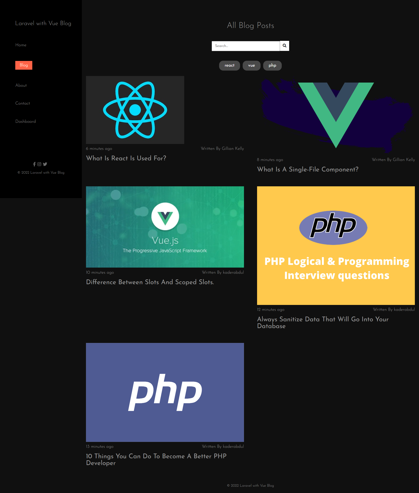
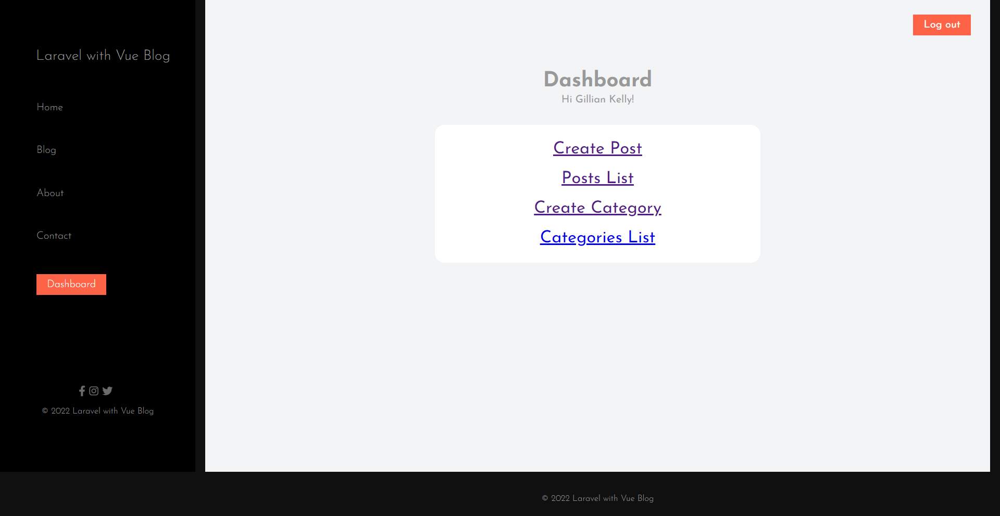
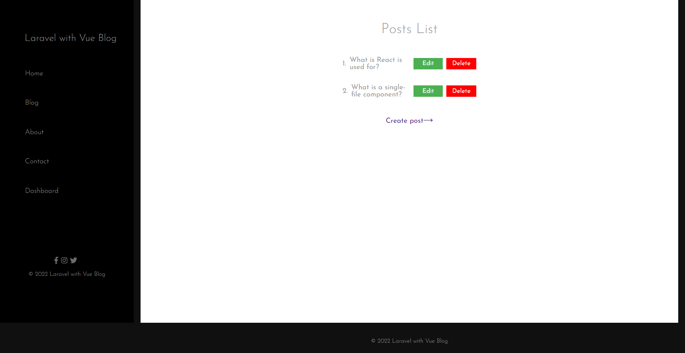

# Laravel with Vue Blog Web Application

## Created Api Using Laravel and consume that Api using Vue (Option Api)

### Live Site Link : https://blog.kaderabdul.com/build/

# blogpage

# dashboard

# Post List

## Features :
 
<ul>For Authentication, Used Laravel Fortify and Snactum package.</ul>
<ul>Anyone Can Register and login with the same credentials</ul>
<ul>Authors Can Add Post Categories and manage them</ul>
<ul>Authors Can Publish Post with image upload.</ul>
<ul>Authors are restricted to manage other authors post</ul>
<ul>User can read post without login as a guest</ul>
<ul>Added search functionality according typing or by category</ul>
<ul>In Single Post, show related 3 latest post according the category</ul>
